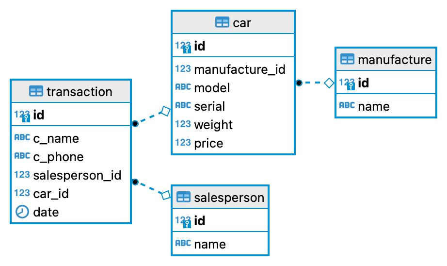
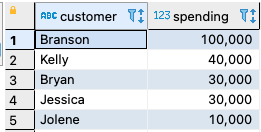
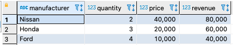

## Detailed write up on Section 2: Databases

#### Starting Postgres
To run the docker, simply naviage into the docker file on your terminal and run the following line to build the postgres docker infrastructure
`docker build -t postgres-custom .`

once completed, we would need run the postgres docker infrastucture using the following line it will name the docker image name as postgres-test. It is important that we do not close this terminal as it would close the postgres service.
`docker run --name postgres-test -p 5432:5432 postgres-custom` 

To delete the container we can simply use `docker rm postgres-test` after ending the docker session.

#### Connecting to Database
For the database connection, follow the following creditials below to connect to the docker postgres successfully. 
**Database:** `car_dealership`
**port:** `5432`
**Username:** `postgres`
**password:** `postgres`

Once connected succesfully, you will find 4 tables in the schema namely, **car**, **manufacture**, **salesperson** and **transaction**. The entity-relation diagram is as follows:



#### SQL queries
**List of our customers and their sales**
```
SELECT c_name as customer, SUM(price) as spending 
FROM "transaction" t INNER JOIN car c 
ON t.car_id = c.id GROUP BY c_name ORDER BY spending DESC; 
```



**Top 3 car manufactures that customers bought by sales (quantity) and the sales number for it in the current month**
```
SELECT m."name" as manufacturer , COUNT(m."name") as quantity, MAX(car.price) as price, SUM(car.price) as revenue 
FROM manufacture m INNER JOIN car ON m.id = car.manufacture_id
INNER JOIN "transaction" t ON car.id = t.car_id 
WHERE date_part('month', date) = date_part('month', now())
GROUP BY m."name" ORDER BY revenue DESC
LIMIT 3;
```



